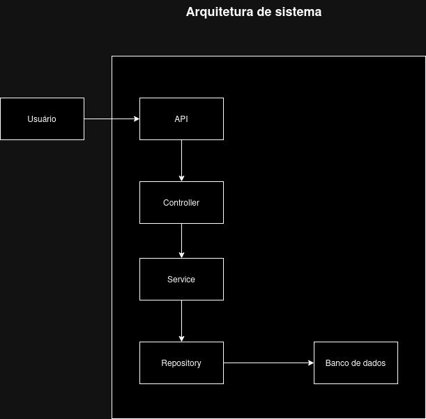

# ReverseLog


## Documantação Swagger

Para que vc tenha acesso aos andpoints da API basta acessa o link logo abaixo:

- [Swagger](http://localhost:8080/swagger-ui.html)

## Como Executar o projeto

Para facilitar a implantação do sistema, foi decidido colocar a aplicação em um container docker, dentro do arquivo 
docker-compose, está todo o passo a passo de como o ambiente deve ser configurado. vou listar o passo a passo como você
pode estar subindo o projeto:

1. Vá para o diretótio raíz do projeto e tenha o docker instalado na sua máquina.
2. Crie um arquivo na raíz com o nome de `.env` com os seguintes dados: 
````
      DB_USERS=nome_do_usuario
      DB_PASSWORD=senha_do_usuario
      MYSQL_ROOT_PASSWORD=senha_root_do_banco
      MYSQL_PASSWORD=senha_do_banco
````
4. Configure as variáveis de ambiente com : `docker-compose -f <nomeDoDockerCompose> config`
5. Execute o comando: `docker compose up`

Pronto, o projeto deve subir e disponibilizar o serviço na porta : `8080` do seu host

# Sistema de Gerenciamento de logistica reversa

## Resumo

O Sistema de Gerenciamento de logistica reversa foi desenvolvido para automatizar o processo de devolução de produtos em
uma distribuidora.

## História

O Sistema de Reverselog foi desenvolvido para atender à necessidade de automatizar o processo de
devolução de produtos em uma distribuidora. O sistema anterior era manual e ineficiente, causando atrasos no
processamento das devoluções e insatisfação dos clientes.

## Motivação

O principal fator que motivou o desenvolvimento do Sistema de Gerenciamento de Devoluções foi a necessidade de:

- Aumentar a eficiência do processo de devolução de produtos: O sistema manual era lento e sujeito a erros, resultando
  em atrasos no processamento das devoluções e insatisfação dos clientes. O novo sistema automatizado permite que as
  devoluções sejam processadas mais rapidamente e com mais precisão.
- Melhorar a experiência do cliente: O novo sistema oferece aos clientes uma maneira rápida e fácil de solicitar a
  devolução de produtos. Além disso, fornece informações sobre o status das devoluções, reduzindo a frustração.
- Reduzir custos: O sistema automatizado ajuda a reduzir custos eliminando a necessidade de trabalho manual e prevenindo
  fraudes e erros.

## Justificativa

O Sistema de Gerenciamento de Devoluções oferece vários benefícios para a empresa, incluindo:

- Maior eficiência: Automatiza o processo de devolução de produtos, permitindo que as devoluções sejam processadas mais
  rapidamente e com mais precisão.
- Melhor experiência do cliente: Oferece aos clientes uma maneira rápida e fácil de solicitar a devolução de produtos e
  fornece informações sobre o status das devoluções, reduzindo a frustração.
- Menores custos: Ajuda a reduzir custos eliminando a necessidade de trabalho manual e prevenindo fraudes e erros.

## Arquitetura 

